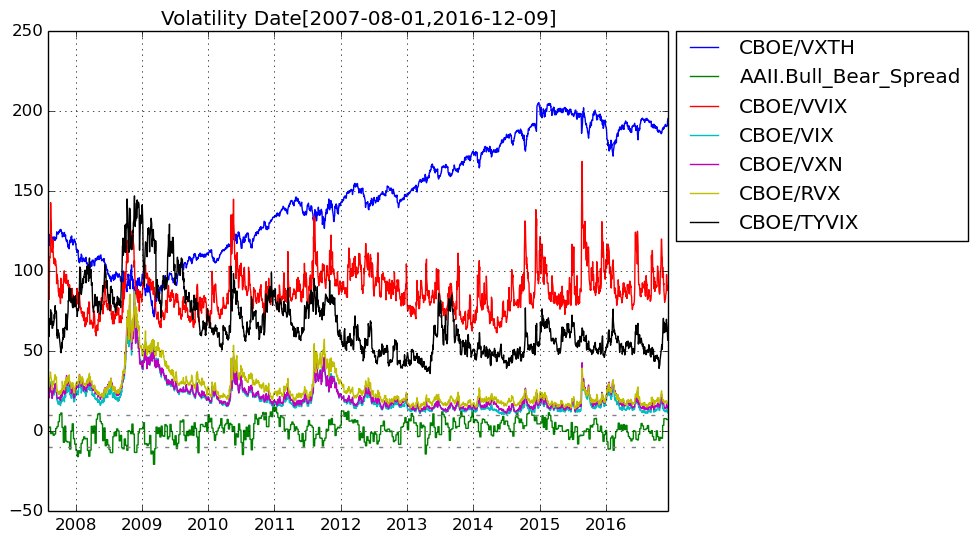

# FinancialData

## This Julia program fetches financial data from Quandl/Yahoo Finance and forecasts short-term price ranges using a random forest.
The code is written in a Jupyter notebook and has been tested with Julia 0.5.0 on juliabox.com.

### Ensemble of Decision Trees  
Trees:      100  
Avg Leaves: 437.17  
Avg Depth:  29.96  

### 3-fold cross validation on regression forest  
Fold 1  
Mean Squared Error:     0.010630566949109256  
Correlation Coeff:      0.9582502272870853  
Coeff of Determination: 0.8992064550348182  

Fold 2  
Mean Squared Error:     0.011385375921103212  
Correlation Coeff:      0.9605884052353014  
Coeff of Determination: 0.8960285440704898  

Fold 3  
Mean Squared Error:     0.010931851684387652  
Correlation Coeff:      0.9566198082432242  
Coeff of Determination: 0.8944581974048808  

Mean Coeff of Determination: 0.8965643988367296  

