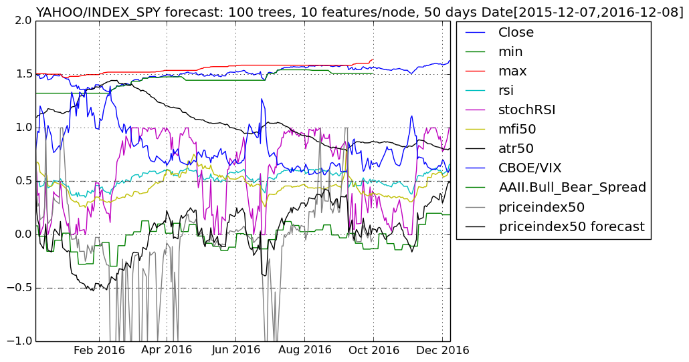

# FinancialData

## This Julia program fetches financial data from Quandl/Yahoo Finance and uses a random forest to forecast the current price's position in relation to its price range over a short term in the future.

The price index in the notebook is a forward looking stochastic oscillator with the Fisher transformation.

The Jupyter notebook is tested with Julia 0.5.0 on juliabox.com.

### Ensemble of Decision Trees  
Trees:      100  
Avg Leaves: 444.04  
Avg Depth:  23.55  

### 3-fold cross validation on regression forest  
Fold 1  
Mean Squared Error:     0.06042219562932451  
Correlation Coeff:      0.8764273959923043  
Coeff of Determination: 0.7183684170605871  

Fold 2  
Mean Squared Error:     0.05408158985324312  
Correlation Coeff:      0.8412112143022242  
Coeff of Determination: 0.6902436731488767  

Fold 3  
Mean Squared Error:     0.04489233435630197  
Correlation Coeff:      0.8663566440941658  
Coeff of Determination: 0.7430096201300622  

Mean Coeff of Determination: 0.717207236779842  

