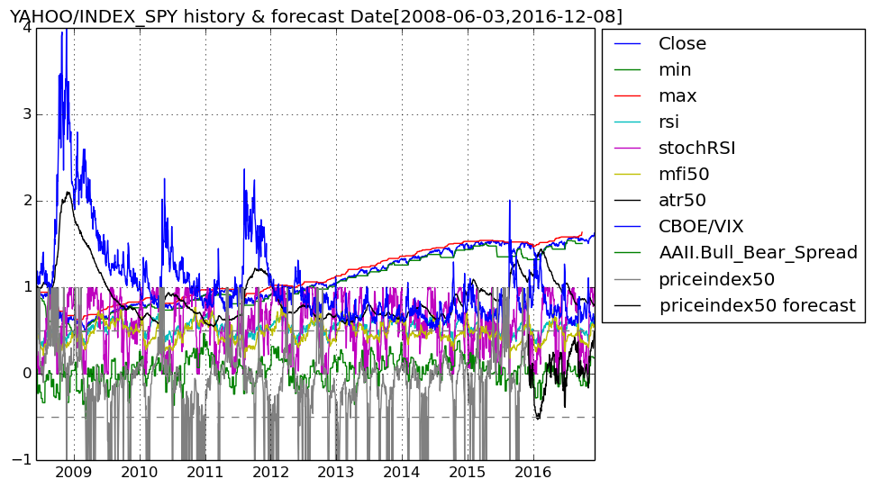
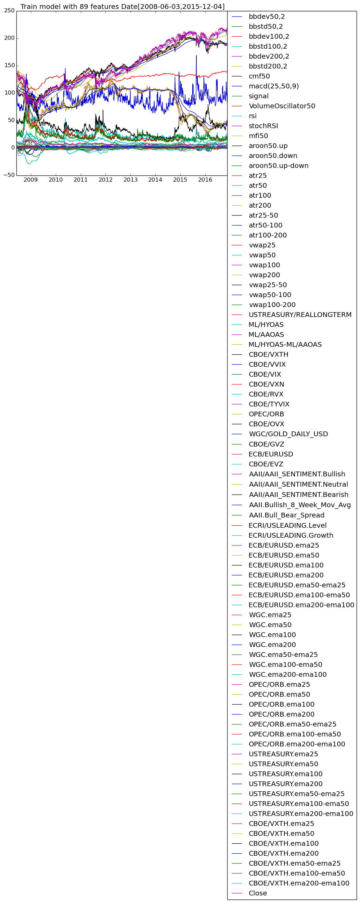

# FinancialData

## This Julia program fetches financial data from Quandl/Yahoo Finance and forecasts short-term price ranges using a random forest.

### Ensemble of Decision Trees  
Trees:      100  
Avg Leaves: 437.23  
Avg Depth:  28.9  

### 3-fold cross validation on regression forest  
Fold 1  
Mean Squared Error:     0.010569725315563121  
Correlation Coeff:      0.9617254663004614  
Coeff of Determination: 0.9015229552799134  

Fold 2  
Mean Squared Error:     0.01104033399689102  
Correlation Coeff:      0.9563548279209828  
Coeff of Determination: 0.8919879352136142  

Fold 3  
Mean Squared Error:     0.011153099432022771  
Correlation Coeff:      0.9590319683304054  
Coeff of Determination: 0.8974632834972178  

Mean Coeff of Determination: 0.8969913913302485  

